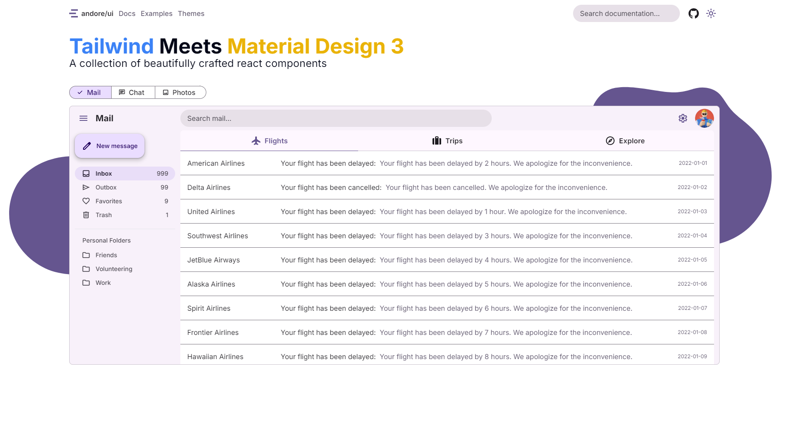

# andore/ui

A collection of beautifully crafted react components that follow the Material Design 3 guidelines.





## What is this project?

This project is a collection of React components that uses [Tailwind CSS](https://tailwindcss.com/) to implement [Material Design 3](https://material.io/design) guidelines

## 🚀 Getting Started

You can install all the components by running the following command:

```bash
npm install @andore-ui/react
```

## 📦 Install specific components

You can install specific components by running the following command:

```bash
npm install @andore-ui/button
```

for more information on the available components, please visit the [documentation](https://andorep.github.io/andore-ui/docs)

## 📚 Documentation

You can find the documentation for this project [here](https://andorep.github.io/andore-ui/docs)

## ☢ Disclaimer

This project is a work in progress and is not affiliated with Google or the Material Design team. 

It is not an official implementation of Material Design 3.


**I do not recommend using this project for production**, it has not been tested and is not stable.

It is intended to be used as a learning resource and a way to experiment with the new Material Design 3 guidelines.

